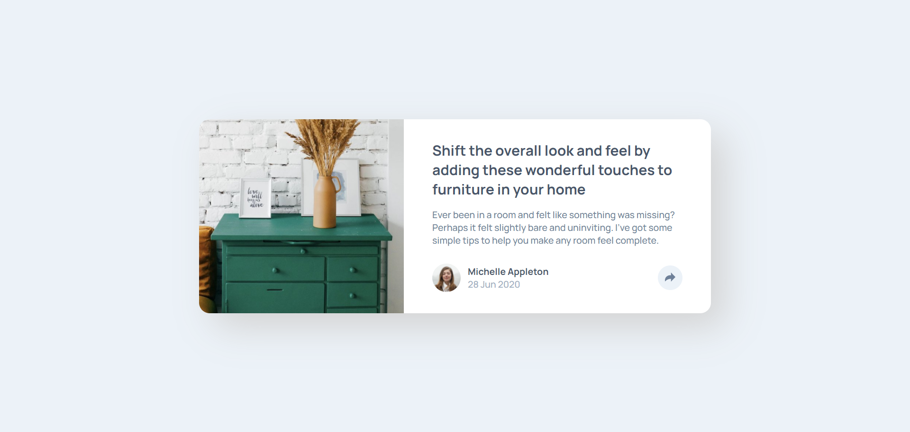
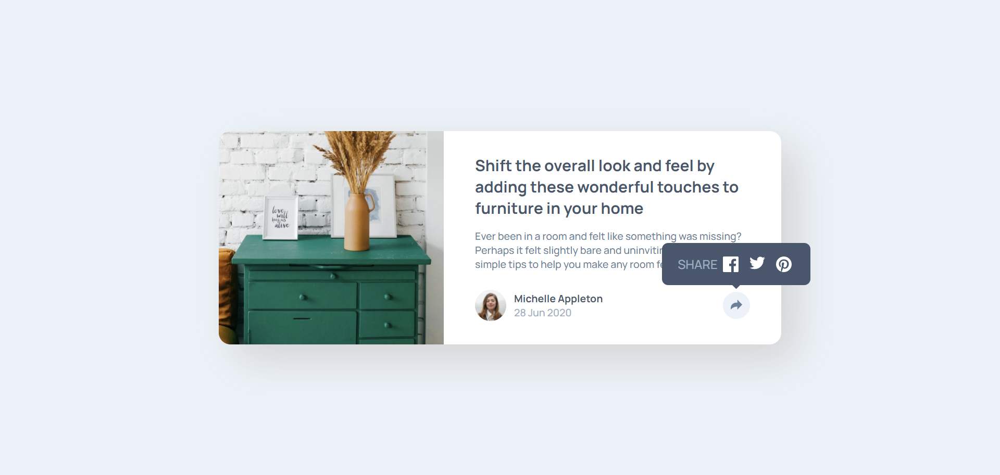
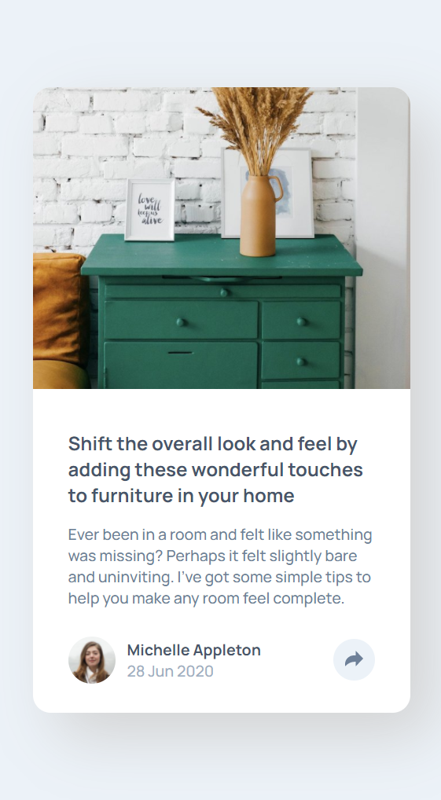
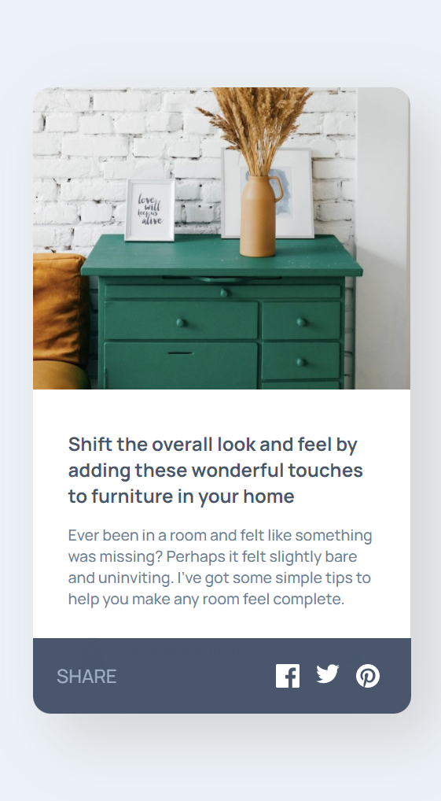

# Frontend Mentor - Article preview component solution

This is a solution to the [Article preview component challenge on Frontend Mentor](https://www.frontendmentor.io/challenges/article-preview-component-dYBN_pYFT). Frontend Mentor challenges help you improve your coding skills by building realistic projects. 

## Table of contents

- [Overview](#overview)
  - [The challenge](#the-challenge)
  - [Screenshot](#screenshot)
  - [Links](#links)
- [My process](#my-process)
  - [Built with](#built-with)
  - [What I learned](#what-i-learned)
  - [Continued development](#continued-development)
  - [Useful resources](#useful-resources)
- [Author](#author)
- [Acknowledgments](#acknowledgments)

**Note: Delete this note and update the table of contents based on what sections you keep.**

## Overview
int this challenge I build same website like a preview image with HTML, CSS, and Javascript DOM.

### The challenge

Users should be able to:

- View the optimal layout for the component depending on their device's screen size
- See the social media share links when they click the share icon

### Screenshot

preview in dekstop

 

preview in dekstop when share is clicked

 

 
preview in mobile

 

 
preview in mobile when share is clicked

### Links

- Solution URL: [https://github.com/aliifam/fem-challenge/](https://github.com/aliifam/fem-challenge/tree/master/01)
- Live Site URL: [https://fem.aliif.space/01/index.html](https://fem.aliif.space/01/index.html)

## My process

my process when build this site is simple just write the HTML structure, after that try the CSS syntax after the style is same as challenge preview, I add the javascript for hiding and showing share pop up.

### Built with

- Semantic HTML5 markup
- CSS custom properties
- Flexbox
- Javascript DOM

### What I learned

I have learned about how to use CSS Flexbox and css positioning.

### Continued development

After this I will learning how to be a Backend Developer.

### Useful resources

- [Example resource 1](https://www.example.com) - This helped me for CSS positioning
- [Example resource 2](https://www.example.com) - This helped me for CSS animation.

## Author

- Website - [Aliif Arief](https://www.aliif.space)
- Frontend Mentor - [@aliifam](https://www.frontendmentor.io/profile/aliifam)
- Twitter - [@lifrief](https://www.twitter.com/lifrief)

## Acknowledgments

Thanks for my lecture who give me this assignment.